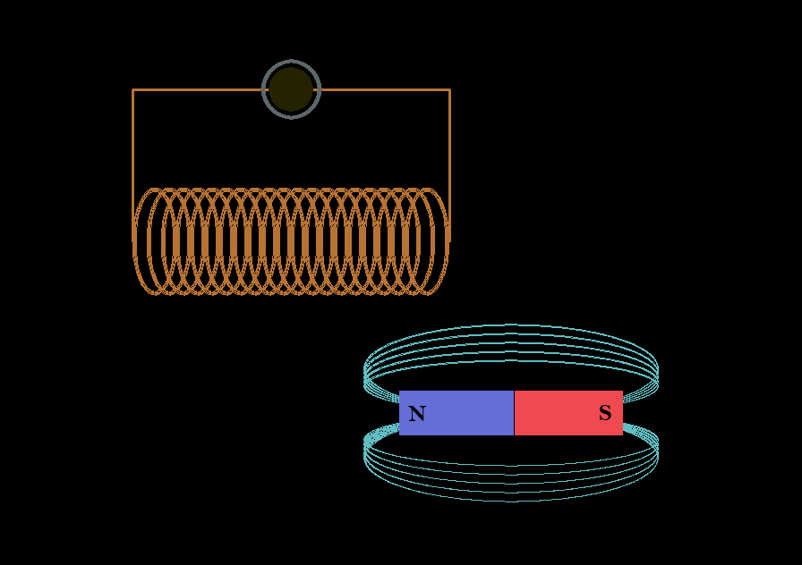
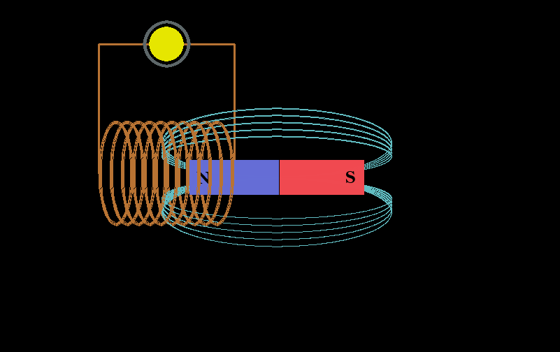

# Electromagnetism simulation
Simulation of electromagnetism made for my school, using pygame

### Controls
| Key | Desciption |
|:---:|:----------:|
| `F` | shows magnetic field |
| `W` | increases strenght of magnetic field |
| `S` | decreases strenght of magnetic field |
| `↑` | decreases diameter of coil |
| `↓` | increases diameter of coil |
| `→` | increases number of coils |
| `←` | decreases number of coils |

Magnet can be draged using mouse pointer

### Screenshots

